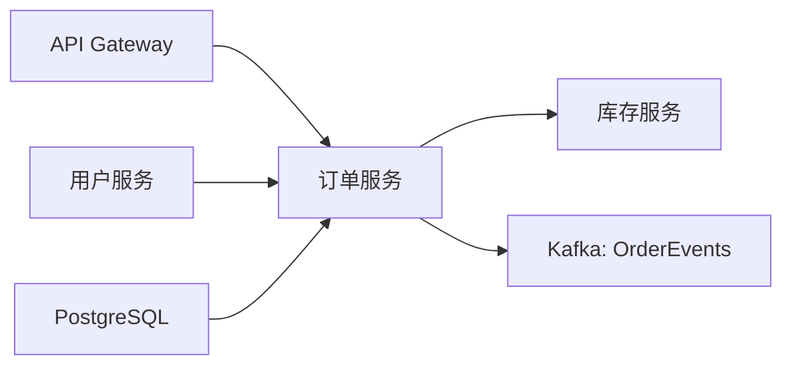
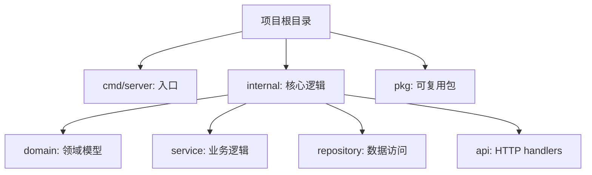
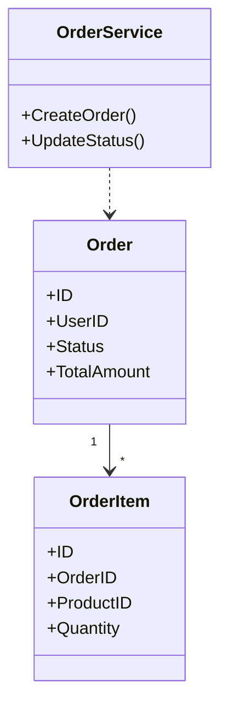
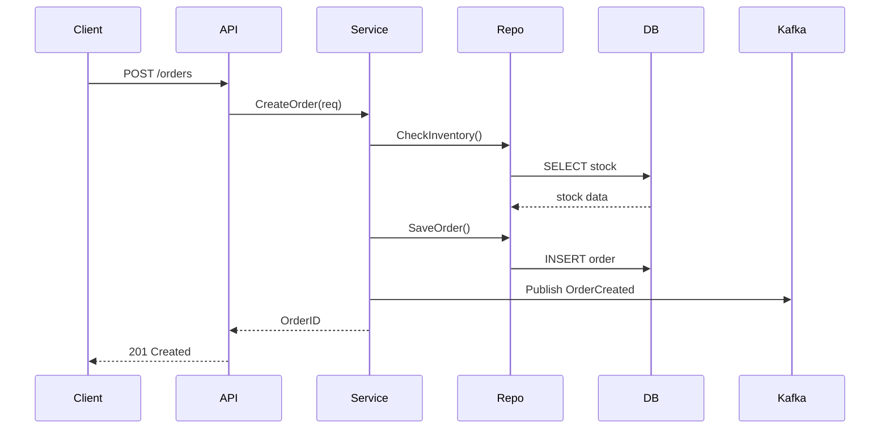

# 项目 Onboarding

为新接触的代码库生成结构化入门文档，帮助快速建立全局认知。输出中文 Markdown，优先用 Mermaid 图表可视化，不展示详细代码，不修改任何文件。

## 核心原则

**图表优先**：每个分析维度都用 Mermaid 图表展示，图表比文字更重要。参考下面的示例输出，看看图表应该长什么样。

**架构层面**：只关注架构和数据流，不要逐行分析代码。

**适应项目**：用项目自己的术语，不要强行套用 DDD 或其他模式。

## 分析维度

按以下三个层次依次展开，每个层次都用 Mermaid 图表展示。

### 1. 全局视角

回答"这个项目为什么存在"：

- **核心价值**：解决什么问题？为谁解决？
- **上下游依赖**：依赖什么外部服务？给谁提供服务？
- **技术栈**：语言、框架、数据库、部署方式

用 Mermaid `graph` 或 `flowchart` 展示上下游依赖关系，用表格列出技术栈。

### 2. 骨架分析

回答"代码怎么组织的"：

- **目录结构**：顶层目录职责、关键子目录作用
- **核心抽象**：主要的模块、组件、服务（根据项目类型调整）

用 Mermaid `graph` 展示目录树（只展示关键路径），如果有明显的核心抽象关系，用 `classDiagram` 或 `graph` 展示。

### 3. 数据流分析

回答"一个典型操作怎么走完整个系统"：

选择 1-2 个最核心的流程，追踪从入口到出口的完整路径。

用 Mermaid `sequenceDiagram` 展示时序。

## 工作流

1. **探索**：快速扫描项目结构，识别项目类型（后端服务、前端应用、数据管道、CLI 工具等）
2. **分析**：根据项目类型，有针对性地分析关键文件和目录
3. **输出**：按"全局视角 → 骨架分析 → 数据流分析"三层结构组织文档，每层都用 Mermaid 图表展示

输出为单个 Markdown 文件，默认命名为 `ONBOARDING.md`。

## 示例输出结构

下面是一个后端服务的示例输出（其他类型项目结构类似，但内容会适配项目类型）：

```markdown
# 项目名称 Onboarding

## 1. 全局视角

### 项目定位
这是一个订单管理服务，为电商平台提供订单创建、查询、状态流转能力。替代了原有的单体应用中的订单模块，支持更高的并发和更灵活的扩展。

### 上下游关系


### 技术栈

| 类别 | 技术 |
|------|------|
| 语言 | Go 1.21 |
| 框架 | Gin + GORM |
| 数据库 | PostgreSQL 15 |
| 消息队列 | Kafka |
| 部署 | Docker + K8s |

## 2. 骨架分析

### 目录结构


**关键目录说明**：
- `cmd/server/main.go`：启动入口，初始化依赖注入
- `internal/domain/`：Order、OrderItem 等核心实体
- `internal/service/`：订单创建、状态流转等业务逻辑
- `internal/repository/`：GORM 数据访问层
- `config/`：环境配置（dev/staging/prod）

### 核心模型


## 3. 数据流分析

### 核心流程：创建订单


**关键步骤**：
1. API 层校验请求参数
2. Service 层调用库存服务检查库存
3. 事务内保存订单和订单项
4. 发送 Kafka 事件通知下游
5. 返回订单 ID
```

## 注意事项

**图表优先**：如果你发现自己写了很多文字但没有画图，立即停下来先画图。参考下面的示例输出。

**架构层面**：只关注架构和数据流，不要逐行分析代码。

**保持中立**：只描述现状，不做架构评价或改进建议。

**用项目的语言**：尊重项目自己的术语，不要强行套用标准模式。
